# MiroFish 需求规格说明书

> 文档版本：v2.0　|　适用系统：MiroFish 多智能体仿真预测引擎

***

## 第一章 项目的背景和意义

### 1.1 项目背景

在数字化时代，社交媒体已成为公共舆论形成、商业信息扩散与社会事件演化的核心场域。Twitter、Reddit 等平台每日产生数以亿计的用户互动，其传播路径与群体反应直接影响品牌营销、产品发布、政策出台、危机公关等重大决策。然而传统的舆情分析工具普遍存在以下局限：

1. **回溯性而非前瞻性**：基于历史文本进行情感分析与关键词统计，只能解释"已经发生了什么"，无法回答"如果这样做会发生什么"。
2. **缺少群体动力学建模**：仅做单条内容的情感打分，忽略用户之间的关注关系、转发链路和子社区演化。
3. **无法定制化推演**：用户需求高度个性化（特定行业、特定人群、特定话题），通用模型难以快速适配。
4. **报告产出僵化**：输出固定模板报告，决策者无法就关键发现进一步追问与互动。

随着大语言模型（LLM）和多智能体仿真框架（如 CAMEL-AI / OASIS）的成熟，构建"可前瞻、可定制、可交互"的社交媒体推演引擎成为可能。MiroFish 项目正是在这一背景下立项。

### 1.2 项目意义

MiroFish 是一个**多智能体仿真预测引擎**：用户上传种子文档并以自然语言描述预测需求，系统自动完成本体抽取、知识图谱构建、Agent 人设生成、Twitter / Reddit 双平台仿真运行、预测报告生成与深度交互问答。其意义体现在以下层面：

- **方法学价值**：将 LLM 驱动的本体生成、图谱推理与多智能体社会仿真整合到统一流水线，验证"文档→图谱→人设→仿真→报告"端到端预测范式的可行性。
- **应用价值**：为品牌方、内容创作者、舆情研究人员、市场分析师提供低门槛、可定制的社交传播推演工具，支持发布前的策略评估与风险规避。
- **产品价值**：相较静态 BI 报表，MiroFish 提供可交互的预测报告——用户可通过对话式界面追问任意子结论、采访任意虚拟 Agent，提升决策置信度。
- **技术价值**：探索 LLM Agent + 子进程隔离 + 文件 IPC 的工程化模式，为长时运行、可中断、可追问的 AI 应用提供参考实现。

***

## 第二章 功能性需求描述

### 2.1 软件功能概述

MiroFish 围绕"五步用户流水线"组织功能，每一步对应前端一个主视图与后端一组 RESTful 蓝图：

| 编号 | 功能模块      | 核心职责                                                     |
| -- | --------- | -------------------------------------------------------- |
| F1 | 项目与文档管理   | 创建预测项目、上传种子文档（PDF/Word/TXT）、解析并合并文本、维护项目状态机              |
| F2 | 本体与图谱构建   | 调用 LLM 抽取本体、异步将实体与关系写入 Zep 知识图谱、前端轮询任务进度并可视化             |
| F3 | 环境搭建与人设生成 | 从图谱读取实体、生成 Twitter / Reddit 双平台 Agent 人设、生成 OASIS 仿真配置   |
| F4 | 仿真运行与监控   | 以子进程方式启动 OASIS 仿真，输出每轮动作流水（actions.jsonl）、运行状态与时间线       |
| F5 | 预测报告生成    | 由 ReportAgent 调用工具读取仿真产物，生成结构化分章报告，支持 SSE 流式增量获取         |
| F6 | 深度交互      | 通过 IPC 命令对仿真子进程中的 Agent 进行单点 / 批量采访；与 ReportAgent 进行报告对话 |
| F7 | 系统支持      | 健康检查、资源清理（atexit 杀子进程）、跨域支持、运行日志归档                       |

### 2.2 自然语言功能需求

按"FR-编号 + 一句话需求陈述 + 关键约束"形式列出，覆盖第 2.3 节十个用例所需的全部业务规则：

| 需求编号  | 自然语言描述                                                                | 关键约束                                                                                    |
| ----- | --------------------------------------------------------------------- | --------------------------------------------------------------------------------------- |
| FR-1  | 用户应能够创建一个新的预测项目，并上传一个或多个种子文档（PDF / DOCX / TXT），系统应解析文档并将合并文本持久化       | 单项目至少接受 1 个文档；解析失败时项目状态置为 `FAILED`                                                      |
| FR-2  | 用户应能够浏览全部历史项目、查看项目详情、删除项目；删除时同步清理 `uploads/projects/<project_id>/` 目录 | 项目状态机 `CREATED → ONTOLOGY_GENERATED → GRAPH_BUILDING → GRAPH_COMPLETED`，任意态可降为 `FAILED` |
| FR-3  | 系统应基于已上传的种子文档自动生成本体（实体类型 + 关系类型），用户可在前端手动编辑确认                         | 必须由 LLM 抽取，调用失败需回滚到 `CREATED`                                                           |
| FR-4  | 系统应基于本体异步构建知识图谱，前端通过任务 ID 轮询进度，并最终拿到 `graph_id`                       | 图谱写入 Zep；构建任务以 daemon 线程承载，禁止阻塞 Flask 主线程                                               |
| FR-5  | 系统应基于知识图谱实体生成 Twitter 与 Reddit 双平台的 Agent 人设（含背景、性格、兴趣、立场）            | 两份 profile JSON 落盘到 `simulations/<sid>/twitter_profiles.json` 与 `reddit_profiles.json`  |
| FR-6  | 用户应能够配置仿真参数（回合数、Agent 数量、话题、平台开关）并生成 `simulation_config.json`         | 配置生成必须在人设生成之后；缺失任意 profile 不允许进入仿真                                                      |
| FR-7  | 用户应能启动仿真并实时监控运行状态、回合进展与动作时间线                                          | 仿真以 subprocess.Popen 启动 `run_parallel_simulation.py`；不在 Flask 主进程内运行                    |
| FR-9  | 系统应在仿真产物（actions.jsonl 等）就绪后生成结构化报告，并以 SSE 流式向前端增量推送章节                | 报告由 ReportAgent 驱动，调用 LLM + 工具，章节落盘到 `reports/<rid>/sections/`                          |
| FR-10 | 用户应能够选定任意 Agent 进行单点采访或批量采访，系统通过文件 IPC 转发命令并取回回答                      | IPC 命令类型：`INTERVIEW` / `BATCH_INTERVIEW` / `CLOSE_ENV`；超时返回错误                           |
| FR-11 | 用户应能够在报告页就任意子结论与 ReportAgent 对话，必要时可触发 Agent 二次采访                     | 报告对话独立于仿真子进程，通过 `/api/report/chat`                                                      |

### 2.3 用例模型

#### 2.3.1 参与者识别

| 参与者               | 类型    | 职责                                                    |
| ----------------- | ----- | ----------------------------------------------------- |
| 用户（User）          | 主参与者  | 业务方，覆盖"创建项目、上传文档、配置仿真、审阅报告、追问 Agent"等全部交互             |
| LLM 服务            | 辅助参与者 | 外部 OpenAI 兼容大模型（推荐百炼 qwen-plus），承担本体抽取、人设生成、报告写作、对话推理 |
| Zep 图谱（Zep Cloud） | 辅助参与者 | 外部知识图谱后端，承担实体与关系的存储、检索                                |

> 注 1：OASIS 仿真引擎、ReportAgent、SimulationRunner 等均为系统**内部组件**（子进程 / 服务类），不画为参与者。"查看进度 / 时间线 / 历史 / 下载"等纯展示动作合并入对应业务用例。
>
> 注 2：虽然 LLM 服务和 Zep 图谱在用例模型中作为辅助参与者，但在顺序图和分析类图中，仅展示用户与系统的交互。LLM/Zep 的调用作为控制类的内部实现细节，属于系统内部行为。

#### 2.3.2 用例图

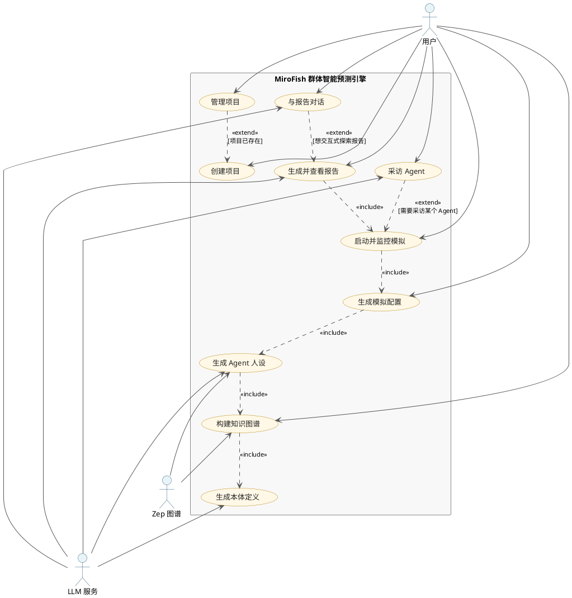

用例清单（共 10 个）：

| 用例编号  | 用例名称        | 主参与者 | 涉及辅助参与者       |
| ----- | ----------- | ---- | ------------- |
| UC-01 | 创建项目        | 用户   | —             |
| UC-02 | 管理项目        | 用户   | —             |
| UC-03 | 生成本体定义      | 用户   | LLM 服务        |
| UC-04 | 构建知识图谱      | 用户   | LLM 服务、Zep 图谱 |
| UC-05 | 生成 Agent 人设 | 用户   | LLM 服务、Zep 图谱 |
| UC-06 | 生成模拟配置      | 用户   | —             |
| UC-07 | 启动并监控模拟     | 用户   | —             |
| UC-08 | 生成并查看报告     | 用户   | LLM 服务        |
| UC-09 | 采访 Agent    | 用户   | LLM 服务        |
| UC-10 | 与报告对话       | 用户   | LLM 服务        |

`<<include>>` 关系（主流水线必经）：UC-04 ⇨ UC-03，UC-05 ⇨ UC-04，UC-06 ⇨ UC-05，UC-07 ⇨ UC-06，UC-08 ⇨ UC-07。
`<<extend>>` 关系（可选触发）：UC-02 ⇨ UC-01，UC-09 ⇨ UC-07，UC-10 ⇨ UC-08。

#### 2.3.3 用例描述

##### UC-01 创建项目

| 项目   | 内容                                                         |
| ---- | ---------------------------------------------------------- |
| 主参与者 | 用户                                                         |
| 前置条件 | 后端服务可用                                                     |
| 后置条件 | 项目目录创建，状态置为 `CREATED`，`extracted_text.txt` 落盘              |
| 主流程  | ① 用户填写项目名 ② 上传一份或多份种子文档 ③ 后端解析文档并合并文本 ④ 持久化 `project.json` |
| 备选流程 | 3a 文档解析失败：返回错误并将项目状态置为 `FAILED`                            |

##### UC-02 管理项目

| 项目   | 内容                                      |
| ---- | --------------------------------------- |
| 主参与者 | 用户                                      |
| 前置条件 | 至少存在一个项目                                |
| 后置条件 | 项目元数据查看 / 更新；删除时目录被清理                   |
| 主流程  | ① 用户进入首页 ② 拉取项目列表 ③ 点击查看 / 删除 ④ 后端响应并刷新 |
| 备选流程 | 3a 删除失败：保留项目并提示用户重试                     |

##### UC-03 生成本体定义

| 项目   | 内容                                                                            |
| ---- | ----------------------------------------------------------------------------- |
| 主参与者 | 用户                                                                            |
| 前置条件 | UC-01 已完成且 `extracted_text.txt` 存在                                            |
| 后置条件 | 项目状态推进至 `ONTOLOGY_GENERATED`，本体写入 `project.json`                              |
| 主流程  | ① 用户点击"生成本体" ② 后端 `OntologyGenerator` 调用 LLM ③ 解析本体 JSON ④ 持久化并返回给前端 ⑤ 用户编辑确认 |
| 备选流程 | 2a LLM 调用失败：状态回滚为 `CREATED` 并返回错误                                             |

##### UC-04 构建知识图谱

| 项目   | 内容                                                                                                 |
| ---- | -------------------------------------------------------------------------------------------------- |
| 主参与者 | 用户                                                                                                 |
| 前置条件 | UC-03 已完成且本体可用                                                                                     |
| 后置条件 | 项目状态推进至 `GRAPH_COMPLETED`，`graph_id` 写回项目                                                          |
| 主流程  | ① 用户点击"构建图谱" ② 后端创建 `task_id` 并 spawn daemon 线程 ③ 异步抽取三元组写入 Zep ④ 前端轮询 `/task/<id>` 直到 `COMPLETED` |
| 备选流程 | 3a Zep 写入失败：标记任务 `FAILED`，状态置为 `FAILED`                                                            |

##### UC-05 生成 Agent 人设

| 项目   | 内容                                                                                                       |
| ---- | -------------------------------------------------------------------------------------------------------- |
| 主参与者 | 用户                                                                                                       |
| 前置条件 | UC-04 已完成                                                                                                |
| 后置条件 | `twitter_profiles.json` 与 `reddit_profiles.json` 落盘                                                      |
| 主流程  | ① 用户进入 Step2EnvSetup ② 后端 `ZepEntityReader` 拉取实体 ③ `OasisProfileGenerator` 调 LLM 生成双平台人设 ④ 持久化两份 profile |
| 备选流程 | 2a 实体不足：提示用户回到 UC-04 修复图谱                                                                                |

##### UC-06 生成模拟配置

| 项目   | 内容                                                                               |
| ---- | -------------------------------------------------------------------------------- |
| 主参与者 | 用户                                                                               |
| 前置条件 | UC-05 已完成                                                                        |
| 后置条件 | `simulation_config.json` 落盘                                                      |
| 主流程  | ① 用户填写回合数 / Agent 数 / 话题 ② 后端 `SimulationConfigGenerator` 校验并合并 profile ③ 写入配置文件 |
| 备选流程 | 2a 字段缺失：返回 422 并指示需要补全的字段                                                        |

##### UC-07 启动并监控模拟

| 项目   | 内容                                                                                                             |
| ---- | -------------------------------------------------------------------------------------------------------------- |
| 主参与者 | 用户                                                                                                             |
| 前置条件 | UC-06 已完成                                                                                                      |
| 后置条件 | 仿真子进程进入"等待命令模式"，`actions.jsonl` / `run_state.json` 持续更新                                                        |
| 主流程  | ① 用户点击"启动仿真" ② `SimulationRunner` spawn 子进程 ③ 前端跳转并轮询 `/run-status` 与 `/timeline` ④ 子进程每轮写动作流水 ⑤ 仿真完成后挂起等待 IPC |
| 备选流程 | 2a 资源占用：抛错并清理半成品4a 用户取消：发送 `CLOSE_ENV` 命令终止                                                                    |

##### UC-08 生成并查看报告

| 项目   | 内容                                                                      |
| ---- | ----------------------------------------------------------------------- |
| 主参与者 | 用户                                                                      |
| 前置条件 | UC-07 已完成且 actions 流水可读                                                 |
| 后置条件 | `reports/<report_id>/sections/*.md` 与 `progress.json` 落盘并标记 `COMPLETED` |
| 主流程  | ① 用户点击"生成报告" ② `ReportAgent` 读取仿真产物 ③ 分章迭代写作并落盘 ④ 前端通过 SSE 增量获取章节       |
| 备选流程 | 3a 章节超时：标记当前章节 `FAILED`，允许重试                                            |

##### UC-09 采访 Agent

| 项目   | 内容                                                                                                                 |
| ---- | ------------------------------------------------------------------------------------------------------------------ |
| 主参与者 | 用户                                                                                                                 |
| 前置条件 | UC-07 完成且子进程仍在等待命令                                                                                                 |
| 后置条件 | 采访结果写入 `ipc_responses/`，由 Flask 转发给前端                                                                              |
| 主流程  | ① 用户在 InteractionView 选定 Agent 提问 ② Flask 写 IPC 命令文件 `INTERVIEW` ③ 子进程轮询读取并驱动 Agent 调 LLM ④ 子进程写响应文件 ⑤ Flask 读取并返回 |
| 备选流程 | 4a 超时未响应：返回超时错误，可重试或关闭环境                                                                                           |

##### UC-10 与报告对话

| 项目   | 内容                                                                                |
| ---- | --------------------------------------------------------------------------------- |
| 主参与者 | 用户                                                                                |
| 前置条件 | UC-08 已完成                                                                         |
| 后置条件 | 对话日志归档到 `reports/<rid>/agent_log/`                                                |
| 主流程  | ① 用户在 ReportView 提问 ② 后端 `ReportAgent.chat` 注入报告上下文调 LLM ③ 返回回答 ④ （可选）触发对子进程的二次采访 |
| 备选流程 | 4a 子进程已关闭：仅基于已写报告回答                                                               |

### 2.4 用例顺序图

> 每个用例对应一张顺序图；编号与 §2.3.3 一一对应。

#### UC-01 创建项目

**描述**：该顺序图展示用户创建新预测项目的完整流程。用户在项目创建界面填写项目名称并上传种子文档，界面将请求提交给项目管理控制器，控制器将项目数据持久化到存储层后返回创建结果，最终界面显示创建成功消息。

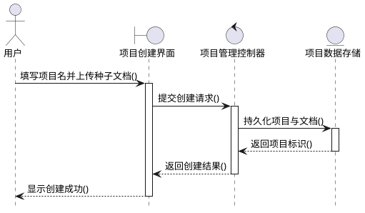

#### UC-02 管理项目

**描述**：该顺序图展示用户浏览、查看和删除项目的管理流程。用户进入项目管理界面进行操作，界面将操作请求发送给项目管理控制器，控制器读取或删除项目数据存储中的信息，操作完成后返回响应数据，界面刷新项目列表展示最新状态。

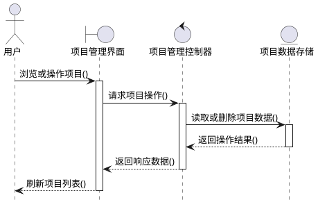

#### UC-03 生成本体定义

**描述**：该顺序图展示基于种子文档生成本体定义的流程。用户在本体生成界面触发生成本体操作，界面调用本体控制器，控制器通过LLM服务从文本中抽取实体和关系，生成结构化本体后持久化到图谱存储，最后返回生成结果给用户确认编辑。

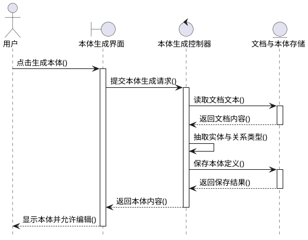

#### UC-04 构建知识图谱

**描述**：该顺序图展示基于本体定义构建知识图谱的流程。用户在图谱构建界面触发构建操作，界面调用图谱控制器，控制器从本体中抽取三元组并写入Zep图谱存储，通过异步任务方式处理，前端轮询任务进度直到完成。

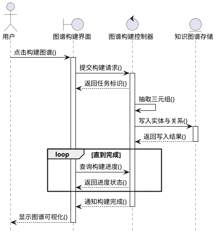

#### UC-05 生成 Agent 人设

**描述**：该顺序图展示基于知识图谱实体生成Agent人设的流程。用户在Agent配置界面触发生成人设操作，界面调用Agent控制器，控制器从Zep图谱读取实体信息，通过LLM服务为每个实体生成Twitter和Reddit双平台人设，最后将人设数据持久化到仿真存储。

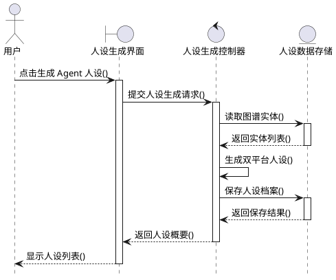

#### UC-06 生成模拟配置

**描述**：该顺序图展示配置仿真参数并生成模拟配置文件的流程。用户在Agent界面填写回合数、Agent数量、话题等参数，界面调用Agent控制器进行参数校验，控制器合并已生成的人设数据，生成完整的仿真配置文件并持久化到仿真存储。

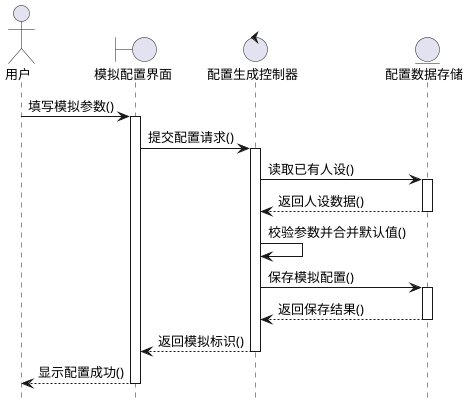

#### UC-07 启动并监控模拟

**描述**：该顺序图展示启动仿真并实时监控运行状态的流程。用户在Agent界面点击启动仿真，界面调用Agent控制器，控制器启动子进程运行仿真，前端跳转至监控页面并轮询运行状态和时间线数据，子进程每轮执行后写入动作流水，仿真完成后进入等待命令模式。

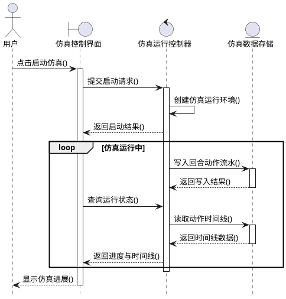

#### UC-08 生成并查看报告

**描述**：该顺序图展示生成仿真报告并查看的流程。用户在报告界面点击生成报告，界面调用报告控制器，控制器的ReportAgent读取仿真产物，分章节迭代写作并落盘，前端通过SSE增量获取章节内容，实时展示报告生成进度。

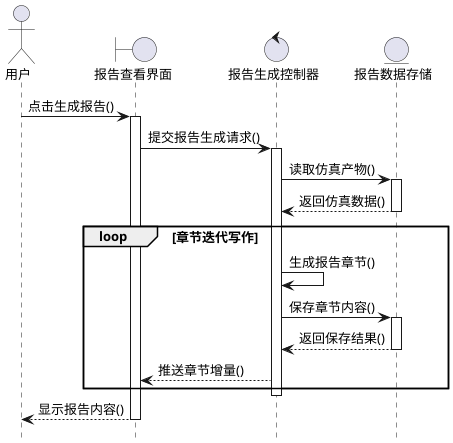

#### UC-09 采访 Agent

**描述**：该顺序图展示对仿真中的Agent进行单点或批量采访的流程。用户在交互界面选定Agent并提问，界面通过IPC机制发送INTERVIEW命令给仿真子进程，子进程轮询读取命令后驱动目标Agent调用LLM生成回答，响应结果写入文件后由控制器读取并返回给用户。

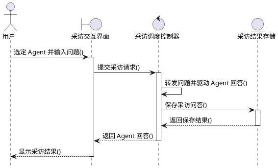

#### UC-10 与报告对话

**描述**：该顺序图展示与生成的仿真报告进行交互式对话的流程。用户在报告查看界面提出问题，界面调用报告控制器，控制器的ReportAgent注入报告上下文调用LLM生成回答，必要时可触发对仿真子进程的二次采访以获取更深入信息，对话日志归档到报告目录。

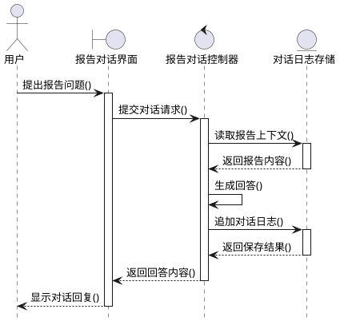

### 2.5 分析类图

> 本节分析类图采用 **健壮性分析（Robustness Analysis）** 方法，所有类与关系均**直接从 §2.4 的十张顺序图中提取**：每张顺序图按 BCE（Boundary / Control / Entity）三类对参与者归类，顺序图中的消息（B→C、C→E、C↔C 自调用）转译为类的方法，参与者之间的消息流转译为类间关联。对十张顺序图的类进行**汇总去重**后，共得到 **5 个边界类、5 个控制类、4 个实体类**，以及 **1 个外部参与者**（用户）。注：LLM 服务和 Zep 图谱为外部协作方，其调用作为控制类的内部实现细节，不在顺序图和分析类图中单独建模。

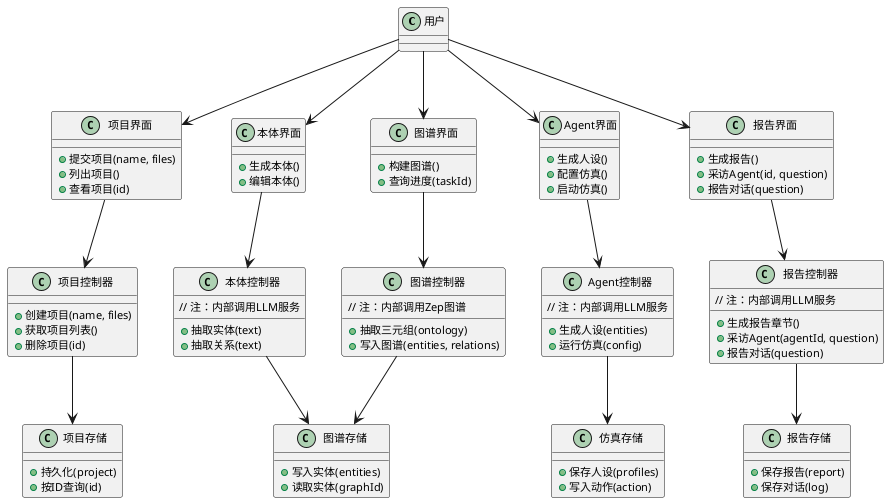

**类汇总表**：

| 层级        | 类名       | 职责说明                     |
| --------- | -------- | ------------------------ |
| **外部参与者** | 用户       | 系统使用者，与所有UI界面交互          |
| **UI层**   | 项目界面     | 项目创建与管理交互界面              |
| **UI层**   | 本体界面     | 本体生成与编辑界面                |
| **UI层**   | 图谱界面     | 图谱构建与可视化界面               |
| **UI层**   | Agent界面  | 人设生成、仿真配置与启动界面           |
| **UI层**   | 报告界面     | 报告生成、采访与对话界面             |
| **控制层**   | 项目控制器    | 项目管理业务逻辑                 |
| **控制层**   | 本体控制器    | 本体抽取业务逻辑（内部调用LLM服务）      |
| **控制层**   | 图谱控制器    | 图谱构建业务逻辑（内部调用Zep图谱）      |
| **控制层**   | Agent控制器 | 人设生成与仿真运行业务逻辑（内部调用LLM服务） |
| **控制层**   | 报告控制器    | 报告生成与交互业务逻辑（内部调用LLM服务）   |
| **实体层**   | 项目存储     | 项目数据持久化                  |
| **实体层**   | 图谱存储     | 知识图谱数据存储                 |
| **实体层**   | 仿真存储     | 仿真配置与人设数据存储              |
| **实体层**   | 报告存储     | 报告与对话数据存储                |

**用例到类的映射**：

| 用例                | 边界类         | 控制类          | 实体类      |
| ----------------- | ----------- | ------------ | -------- |
| UC-01 创建项目        | 项目界面        | 项目控制器        | 项目存储     |
| UC-02 管理项目        | 项目界面 ★共用    | 项目控制器 ★共用    | 项目存储 ★共用 |
| UC-03 生成本体定义      | 本体界面        | 本体控制器        | 图谱存储     |
| UC-04 构建知识图谱      | 图谱界面        | 图谱控制器        | 图谱存储     |
| UC-05 生成 Agent 人设 | Agent界面     | Agent控制器     | 仿真存储     |
| UC-06 生成模拟配置      | Agent界面 ★共用 | Agent控制器 ★共用 | 仿真存储 ★共用 |
| UC-07 启动并监控模拟     | Agent界面 ★共用 | Agent控制器 ★共用 | 仿真存储 ★共用 |
| UC-08 生成并查看报告     | 报告界面        | 报告控制器        | 报告存储     |
| UC-09 采访 Agent    | 报告界面 ★共用    | 报告控制器 ★共用    | 报告存储 ★共用 |
| UC-10 与报告对话       | 报告界面 ★共用    | 报告控制器 ★共用    | 报告存储 ★共用 |

**关系提取规则**：

- 顺序图中 `actor → boundary` 的消息 → 类图中 `用户 → 界面` 关联（共 5 条）
- 顺序图中 `boundary → control` 的消息 → 类图中 `界面 → 控制器` 依赖（共 5 条；同一界面/控制器被多个用例共用）
- 顺序图中 `control → entity` 的消息 → 类图中 `控制器 → 存储` 依赖（共 5 条）
- 顺序图中 `control → control` 的自调用消息 → 内化为该控制类的方法（如"抽取三元组()"、"生成双平台人设()"）
- 顺序图中各方向消息的"动词" → 该消息**接收方**类的方法签名

**外部服务说明**：

LLM服务和Zep图谱为系统外部的协作方，其调用作为控制类的内部实现细节。在本分析类图中：

- 本体控制器：内部调用LLM服务完成实体与关系抽取
- 图谱控制器：内部调用Zep图谱完成实体与关系写入
- Agent控制器：内部调用LLM服务完成人设生成
- 报告控制器：内部调用LLM服务完成报告章节生成与对话回答

**类图说明**：

- **外部参与者**（1个）：用户，与系统所有界面交互
- **边界层 Boundary**（5个）：UI界面类，承担"接收用户输入 + 显示返回结果"两类职责
- **控制层 Control**（5个）：业务逻辑控制器，封装对应用例的业务流程
- **实体层 Entity**（4个）：数据存储抽象，对应文件落盘策略（`backend/uploads/projects/`、`simulations/`、`reports/`）

***

## 第三章 非功能性需求

| 编号     | 类别     | 需求描述                                                         | 度量指标                                                                        |
| ------ | ------ | ------------------------------------------------------------ | --------------------------------------------------------------------------- |
| NFR-1  | 性能     | 本体生成、图谱构建、报告生成等长耗时任务必须以异步 / 流式方式响应，避免阻塞前端                    | 前端 axios 超时 ≤ 5 分钟；图谱走线程 + 任务表轮询；报告走 SSE                                    |
| NFR-2  | 性能     | 单次仿真在 1 万级动作规模下应稳定运行                                         | 子进程 ≥ 30 分钟稳定运行；内存峰值 ≤ 主机 80%                                               |
| NFR-3  | 可用性    | 仿真 / 报告生成中途异常须可恢复或可重启，不污染其他项目数据                              | 每个 simulation\_id 独立目录；状态机字段 `FAILED` 可重试                                   |
| NFR-4  | 可靠性    | 仿真子进程在 Flask 退出时不能成为孤儿进程                                     | `atexit` 清理钩子在 `SimulationRunner.register_cleanup()` 中已注册并必须保留              |
| NFR-5  | 可维护性   | 单文件代码不超过 400 行，代码嵌套不超过 4 层；优先 Edit 而非重写                      | 代码评审硬性门槛                                                                    |
| NFR-6  | 可扩展性   | 新增 IPC 命令必须三处同步：`CommandType` 枚举、子进程 dispatcher、Flask 客户端    | 评审清单中固定检查项                                                                  |
| NFR-7  | 可移植性   | 支持 Windows / macOS / Linux；提供 Docker Compose 一键部署            | `docker compose up -d` 端口 3000 / 5001 可用                                    |
| NFR-8  | 安全性    | 所有外部 LLM / Zep 凭证仅通过根目录 `.env` 注入，禁止入库                       | `Config.validate()` 启动时校验，缺失即 `sys.exit(1)`                                 |
| NFR-9  | 安全性    | 后端 CORS 仅对 `/api/*` 路径开放                                     | 由 `create_app()` 统一注册                                                       |
| NFR-10 | 兼容性    | LLM 接口必须遵循 OpenAI 兼容规范，便于切换百炼 / OpenAI / Boost 加速模型          | 配置项：`LLM_BASE_URL`、`LLM_MODEL_NAME`、可选 `LLM_BOOST_*`                        |
| NFR-11 | 国际化与编码 | Windows 控制台必须保持 UTF-8 输出                                     | `backend/run.py` 与 `scripts/run_parallel_simulation.py` 顶部的 UTF-8 设置代码块禁止删除 |
| NFR-12 | 运行环境   | Node.js ≥ 18、Python ≥ 3.11 且 ≤ 3.12，依赖管理使用 `uv`              | `npm run setup:all` 一键安装                                                    |
| NFR-13 | 端口策略   | 启动时若 3000 / 5001 被占用，必须强制 kill 占用进程，不允许更换端口                  | 项目规则强制                                                                      |
| NFR-14 | 可观测性   | 每个仿真有独立 `simulation.log`，每个报告有 `agent_log/` 与 `console_log/` | 落盘文件树规范                                                                     |
| NFR-15 | 数据持久化  | 系统不引入数据库，全部状态以文件落盘于 `backend/uploads/`                       | 引入数据库 / 队列前必须先讨论                                                            |

