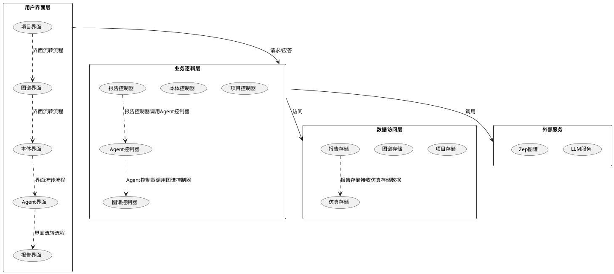
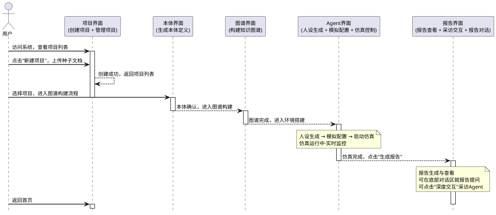
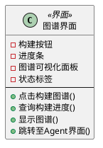

# 第三章 系统设计

本章主要阐述MiroFish多智能体仿真预测引擎的系统设计方案。首先介绍系统的整体架构设计，包括分层架构的选择依据和各层职责；然后详细描述用户界面的设计，包括界面跳转流程和各界面的具体设计。

## 3.1 系统体系结构设计

### 3.1.1 架构设计原则

MiroFish系统采用经典的分层架构（Layered Architecture）作为系统架构风格。分层架构是Web应用领域最成熟、最稳定的架构风格之一，其核心设计原则是高内聚低耦合。在该架构中，每层仅处理自身职责范围内的事务，层与层之间通过明确的接口进行交互，上层依赖下层，而下层不感知上层。

选择分层架构作为MiroFish系统的架构风格主要基于以下三方面考虑：

首先，MiroFish的业务流程呈现线性流水线特征，即"文档→图谱→人设→仿真→报告"的处理流程。这种线性的业务流程天然适合自上而下的分层调用模式，各层职责清晰，便于系统的理解和维护。

其次，MiroFish系统采用前后端分离的技术架构，前端使用Vue框架，后端使用Flask框架，两者在物理上分离部署。这种分离要求在系统架构中设计一个清晰的HTTP边界层，以规范前后端之间的数据交互。

最后，MiroFish系统的数据存储涉及两种异构后端：本地文件系统和外部云服务（包括Zep知识图谱服务和LLM API服务）。数据访问层能够将这种存储差异进行有效封装，使得业务逻辑层无需关心数据的具体存储位置和存储方式，从而提高系统的可维护性和可扩展性。

### 3.1.2 系统包图

根据分层架构的设计原则，MiroFish系统被划分为四个层次：用户界面层、业务逻辑层、数据访问层和外部服务层。图3-1展示了系统的整体包图结构。

**图3-1 MiroFish系统包图**

如图3-1所示，系统包图清晰地展示了四个层次及其内部组件，以及各层次之间的依赖关系。各层次之间的依赖关系遵循分层架构的基本原则，即上层依赖下层，下层不依赖上层。

### 3.1.3 各层职责与交互说明

#### 3.1.3.1 用户界面层

用户界面层是系统与用户交互的入口，采用Vue 3单页应用（Single Page Application，SPA）架构实现。该层的主要职责包括用户界面的渲染和用户操作的响应，不包含任何业务逻辑。

用户界面层包含五个核心界面：项目界面、图谱界面、本体界面、Agent界面和报告界面。这五个界面按照预定的业务流程进行流转，即项目界面→图谱界面→本体界面→Agent界面→报告界面。用户在界面上的所有操作都被转换为对后端REST API的异步调用，通过HTTP协议与业务逻辑层进行通信。

用户界面层的设计遵循"瘦客户端"原则，仅负责界面展示和用户交互，将所有的业务逻辑处理委托给后端的业务逻辑层。这种设计方式不仅降低了前端的复杂度，也提高了系统的可维护性和可测试性。

#### 3.1.3.2 业务逻辑层

业务逻辑层是MiroFish系统的核心层次，负责处理系统的核心业务逻辑。该层采用Python Flask框架实现，包含五个控制器：项目控制器、图谱控制器、本体控制器、Agent控制器和报告控制器。

各控制器之间存在明确的调用关系：报告控制器调用Agent控制器，Agent控制器调用图谱控制器。这种调用关系反映了系统的业务逻辑流程，即报告生成依赖于Agent仿真，Agent仿真依赖于知识图谱。

业务逻辑层的主要职责包括：项目管理、图谱构建、本体生成、Agent人设管理和报告生成等功能。该层通过调用数据访问层和外部服务层来完成具体的业务操作，向上层提供统一的业务接口。

#### 3.1.3.3 数据访问层

数据访问层负责封装所有的数据读写操作，向上层提供统一的数据访问接口。该层包含四个存储模块：项目存储、图谱存储、仿真存储和报告存储。

数据访问层的主要职责包括：数据的持久化管理、数据的查询和检索、数据的一致性维护等。其中，报告存储模块需要从仿真存储模块中获取仿真数据，作为报告生成的数据来源。

通过数据访问层的封装，业务逻辑层无需关心数据的具体存储方式和存储位置，从而实现了业务逻辑与数据存储的解耦。这种设计方式不仅提高了系统的可维护性，也便于系统在不同存储环境下的部署和迁移。

#### 3.1.3.4 外部服务层

外部服务层包含系统依赖的外部服务，主要包括LLM服务和Zep图谱服务。LLM服务负责提供大语言模型的能力，支持本体生成、人设生成、报告生成等需要AI能力的任务。Zep图谱服务负责知识图谱的存储和查询，支持图谱的构建和检索。

业务逻辑层通过调用外部服务层来完成特定的业务功能。外部服务层将外部服务的调用细节进行封装，包括API密钥管理、连接池管理、重试策略等，从而简化了业务逻辑层的调用复杂度。

外部服务层的设计使得系统可以方便地集成新的外部服务，也便于对现有外部服务进行替换或升级，从而提高了系统的可扩展性和灵活性。

## 3.2 用户界面设计

### 3.2.1 界面设计概述

MiroFish系统的用户界面设计基于第二章§2.5中BCE分析类图的边界类设计。原始十个用例对应的UI01~UI10按照BCE原则被归类合并为五个核心界面：项目界面（合并UI01和UI02）、本体界面（对应UI03）、图谱界面（对应UI04）、Agent界面（合并UI05、UI06和UI07）、报告界面（合并UI08、UI09和UI10）。

本节将从界面跳转流程和界面类结构两个维度对MiroFish系统的用户界面进行详细设计。界面跳转流程描述了用户在使用系统过程中的界面流转路径，界面类结构则详细描述了每个界面的组成元素和交互功能。

### 3.2.2 界面跳转顺序图

用户使用MiroFish系统的典型路径为：项目界面创建/管理项目→本体界面生成本体→图谱界面构建图谱→Agent界面完成人设、配置与仿真→报告界面查看报告、对话与采访。图3-2以顺序图的形式展示了五个界面之间的跳转关系。

**图3-2 MiroFish界面跳转顺序图**

如图3-2所示，界面跳转顺序图清晰地展示了用户在使用系统过程中的交互流程。各界面之间的跳转规则如下：

（1）项目界面→本体界面：用户在项目界面创建或选择项目后，进入该项目的图谱构建流程，入口为本体界面。

（2）本体界面→图谱界面：用户确认LLM抽取的本体定义后，自动进入图谱构建步骤。

（3）图谱界面→Agent界面：知识图谱构建完成并可视化确认后，进入环境搭建阶段；Agent界面内部按顺序流转，包括读取实体、生成双平台人设、填写仿真参数、启动并监控仿真等步骤。

（4）Agent界面→报告界面：仿真运行结束（或用户主动停止）后，用户点击"生成报告"跳转至报告界面。

（5）报告界面内部交互：报告界面聚合了报告查看、报告对话与Agent采访三项功能，用户可以逐章阅读报告、在底部对话区就报告内容提问，或点击"深度交互"进入采访面板。

（6）任意界面→项目界面：用户可以通过浏览器返回或导航栏回到项目列表首页。

### 3.2.3 界面设计类图

本节将第二章§2.5中BCE分析类图的五个边界类展开为详细的界面设计类图。每个类的属性代表该界面上的核心UI元素（包括按钮、输入框、列表、标签、可视化组件等），方法代表用户在该界面上的交互动作（包括点击、提交、刷新、跳转等）。

#### 3.2.3.1 项目界面设计

项目界面是用户进入系统后的第一个界面，负责项目的创建和管理。图3-3展示了项目界面的设计类图。

```plantuml
@startuml
skinparam backgroundColor #FFFFFF
skinparam shadowing false
skinparam defaultFontSize 12

class "项目界面" <<界面>> {
  ' —— 项目管理区 ——
  - 项目列表表格
  - <<input>> 搜索筛选输入框
  - 删除按钮
  - 状态标签
  ' —— 项目创建区 ——
  - <<input>> 项目名称输入框
  - <<input>> 文件上传组件
  - 提交按钮
  --
  + 加载项目列表()
  + 筛选项目()
  + 删除项目()
  + 填写项目名()
  + 上传种子文档()
  + 提交创建请求()
  + 跳转至本体生成()
}
@enduml
```

**图3-3 项目界面设计类图**

如图3-3所示，项目界面分为项目管理区和项目创建区两个功能区域。项目管理区包括项目列表表格、搜索筛选输入框、删除按钮和状态标签，用于展示和管理已有的项目。项目创建区包括项目名称输入框、文件上传组件和提交按钮，用于创建新项目。

项目界面的主要功能包括：加载项目列表、筛选项目、删除项目、填写项目名、上传种子文档、提交创建请求和跳转至本体生成。其中，项目列表表格展示全部历史项目及其名称、状态、创建时间；搜索筛选输入框支持按项目名称关键字筛选列表；文件上传组件支持PDF、DOCX、TXT等多文件拖拽上传。

#### 3.2.3.2 本体界面设计

本体界面负责本体定义的生成和编辑。图3-4展示了本体界面的设计类图。

```plantuml
@startuml
skinparam backgroundColor #FFFFFF
skinparam shadowing false
skinparam defaultFontSize 12

class "本体界面" <<界面>> {
  - 生成按钮
  - 实体类型列表
  - 关系类型列表
  - <<input>> 本体编辑器
  - 确认保存按钮
  --
  + 点击生成本体()
  + 编辑本体定义()
  + 保存本体()
  + 跳转至图谱构建()
}
@enduml
```

**图3-4 本体界面设计类图**

如图3-4所示，本体界面包含生成按钮、实体类型列表、关系类型列表、本体编辑器和确认保存按钮。生成按钮用于触发LLM从种子文档中抽取候选本体类型；实体类型列表展示LLM抽取的候选实体类型（如品牌、用户、话题等）；关系类型列表展示候选关系类型（如发布、转发、关注等）；本体编辑器支持用户手动增删改实体与关系类型定义；确认保存按钮用于保存编辑后的本体定义并持久化。

本体界面的主要功能包括：点击生成本体、编辑本体定义、保存本体和跳转至图谱构建。其中，点击生成本体功能触发LLM抽取候选本体类型；编辑本体定义功能允许用户在本体编辑器中修改候选类型；保存本体功能将最终的本体定义保存到系统中；跳转至图谱构建功能在本体保存后自动进入图谱构建步骤。

#### 3.2.3.3 图谱界面设计

图谱界面负责知识图谱的构建和可视化。图3-5展示了图谱界面的设计类图。

**图3-5 图谱界面设计类图**

如图3-5所示，图谱界面包含构建按钮、进度条、图谱可视化面板和状态标签。构建按钮用于触发异步三元组抽取与知识图谱写入任务；进度条展示异步图谱构建任务的完成百分比；图谱可视化面板以D3力导向图实时渲染实体节点与关系边；状态标签标识构建任务状态（构建中/已完成/失败）。

图谱界面的主要功能包括：点击构建图谱、查询构建进度、显示图谱和跳转至Agent界面。其中，点击构建图谱功能启动图谱构建任务；查询构建进度功能通过前端轮询获取任务进度并更新进度条；显示图谱功能在构建完成后渲染D3力导向图；跳转至Agent界面功能在图谱构建成功后进入环境搭建与仿真阶段。

#### 3.2.3.4 Agent界面设计

Agent界面是系统中功能最复杂的界面，负责Agent人设生成、仿真配置和仿真控制。图3-6展示了Agent界面的设计类图。

```plantuml
@startuml
skinparam backgroundColor #FFFFFF
skinparam shadowing false
skinparam defaultFontSize 12

class "Agent界面" <<界面>> {
  ' —— 人设生成区 ——
  - 生成按钮
  - 实体列表
  - <<input>> 平台切换标签
  - 人设卡片列表
  ' —— 模拟配置区 ——
  - <<input>> 回合数输入框
  - <<input>> Agent数量输入框
  - <<input>> 话题文本输入框
  - <<input>> 平台开关
  - 提交按钮
  ' —— 仿真控制区 ——
  - 启动按钮
  - 停止按钮
  - 仿真状态标签
  - 仿真进度条
  - 动作时间线列表
  - <<input>> 平台筛选标签
  --
  + 读取图谱实体()
  + 生成双平台人设()
  + 查看人设详情()
  + 填写模拟参数()
  + 校验参数()
  + 提交配置()
  + 点击启动仿真()
  + 查询运行状态()
  + 加载时间线()
  + 停止仿真()
  + 跳转至报告界面()
}
@enduml
```

**图3-6 Agent界面设计类图**

如图3-6所示，Agent界面分为人设生成区、模拟配置区和仿真控制区三个功能区域。人设生成区包括生成按钮、实体列表、平台切换标签和人设卡片列表，用于生成和管理Agent的人设信息。模拟配置区包括回合数输入框、Agent数量输入框、话题文本输入框、平台开关和提交按钮，用于配置仿真参数。仿真控制区包括启动按钮、停止按钮、仿真状态标签、仿真进度条、动作时间线列表和平台筛选标签，用于控制仿真的运行和监控仿真的状态。

Agent界面的主要功能包括：读取图谱实体、生成双平台人设、查看人设详情、填写模拟参数、校验参数、提交配置、点击启动仿真、查询运行状态、加载时间线、停止仿真和跳转至报告界面。其中，生成双平台人设功能触发LLM为全部实体生成Twitter和Reddit双平台人设；动作时间线列表按时间倒序展示每轮Agent动作流水；平台筛选标签支持按Twitter/Reddit筛选时间线中的动作。

#### 3.2.3.5 报告界面设计

报告界面负责报告的生成、查看和交互。图3-7展示了报告界面的设计类图。

```plantuml
@startuml
skinparam backgroundColor #FFFFFF
skinparam shadowing false
skinparam defaultFontSize 12

class "报告界面" <<界面>> {
  ' —— 报告查看区 ——
  - 生成报告按钮
  - 章节导航列表
  - 报告内容面板
  - 进度标签
  ' —— 采访交互区 ——
  - Agent选择列表
  - <<input>> 采访问题输入框
  - 发送采访按钮
  - 采访结果面板
  - 采访历史列表
  ' —— 报告对话区 ——
  - <<input>> 对话输入框
  - 发送对话按钮
  - 对话历史列表
  --
  + 点击生成报告()
  + 加载章节列表()
  + 查看章节内容()
  + 选定Agent()
  + 输入采访问题()
  + 发送采访请求()
  + 查看采访历史()
  + 输入对话问题()
  + 发送对话请求()
  + 查看对话历史()
  + 返回项目界面()
}
@enduml
```

**图3-7 报告界面设计类图**

如图3-7所示，报告界面分为报告查看区、采访交互区和报告对话区三个功能区域。报告查看区包括生成报告按钮、章节导航列表、报告内容面板和进度标签，用于报告的生成和查看。采访交互区包括Agent选择列表、采访问题输入框、发送采访按钮、采访结果面板和采访历史列表，用于与仿真Agent进行采访交互。报告对话区包括对话输入框、发送对话按钮和对话历史列表，用于与报告智能体进行对话交互。

报告界面的主要功能包括：点击生成报告、加载章节列表、查看章节内容、选定Agent、输入采访问题、发送采访请求、查看采访历史、输入对话问题、发送对话请求、查看对话历史和返回项目界面。其中，生成报告按钮触发ReportAgent开始逐章生成预测报告；章节导航列表展示报告章节目录树，生成过程中逐章解锁；报告内容面板以Markdown格式渲染的报告正文阅读区；采访问题输入框接收用户向Agent提出的采访问题文本；发送采访按钮通过IPC通道将问题转发至仿真子进程中的目标Agent；对话输入框接收用户就报告内容提出的问题文本；发送对话按钮将问题与报告上下文一并发送至ReportAgent。

## 3.3 本章小结

本章完成了MiroFish多智能体仿真预测引擎的系统设计工作，包括确定分层架构风格（用户界面层、业务逻辑层、数据访问层、外部服务层）并设计系统包图，基于BCE分析设计五个核心界面及跳转流程并绘制顺序图和类图，以及按照学术规范组织设计文档。在设计过程中，AI工具提供了有益的辅助，主要包括梳理架构设计原则、生成PlantUML图表框架、优化文档格式和语言、提供内容组织建议等，显著提升了工作效率。但AI也存在一定局限性，如对多智能体领域业务逻辑理解深度不足、图表布局不够优化、创新性设计能力有限、细节把控不够精准等，因此核心架构设计、业务逻辑梳理、界面交互细节等关键工作仍需人工主导完成。本章采用"人工主导、AI辅助"的协作模式，既发挥了AI在效率方面的优势，又保证了人工在设计深度和创新性方面的主导作用，为后续系统实现提供了详细的设计指导。